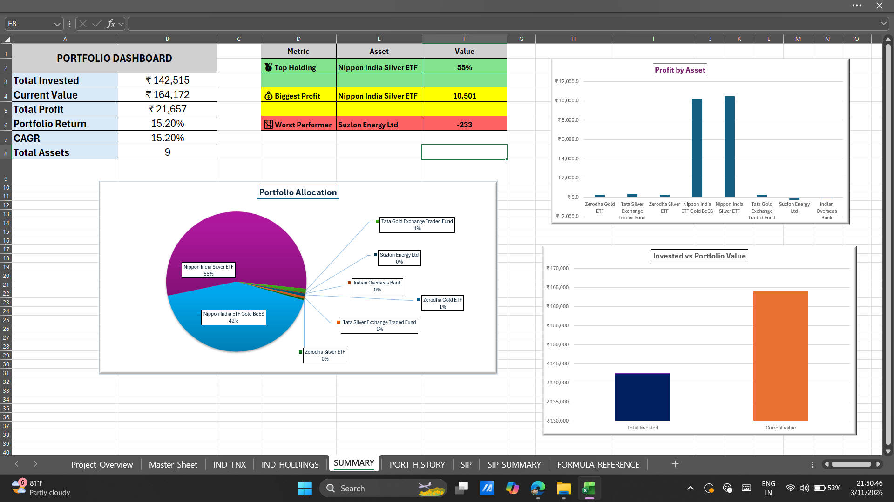
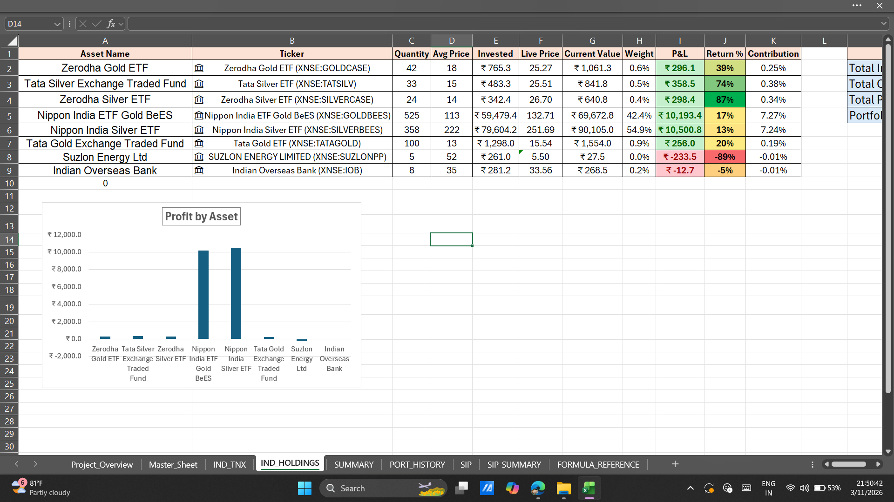
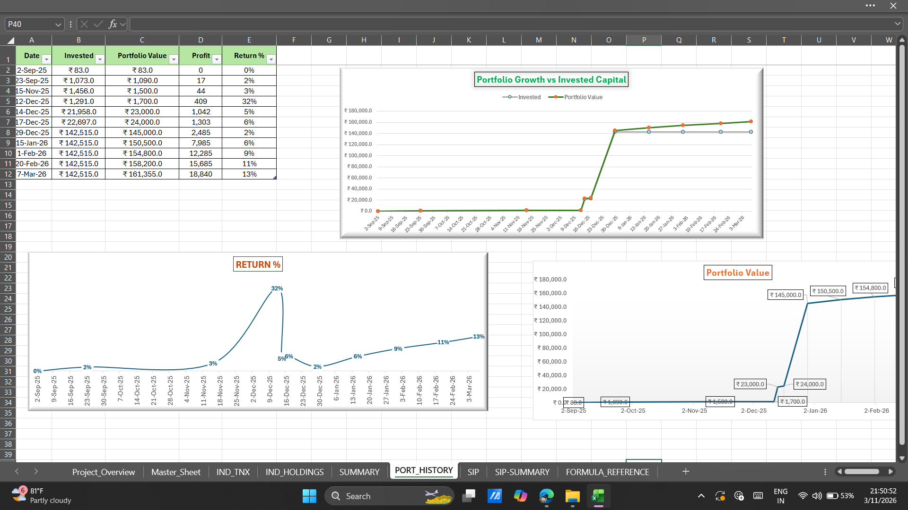
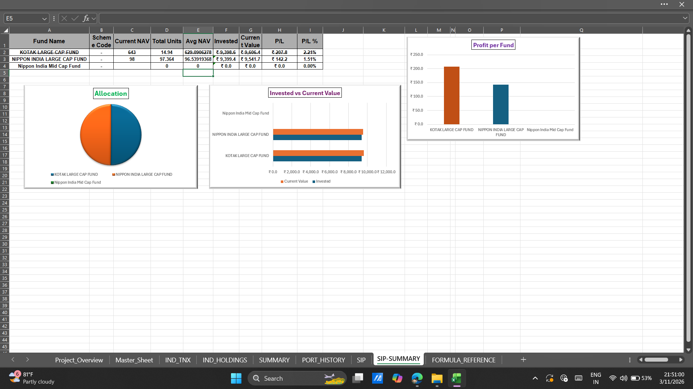
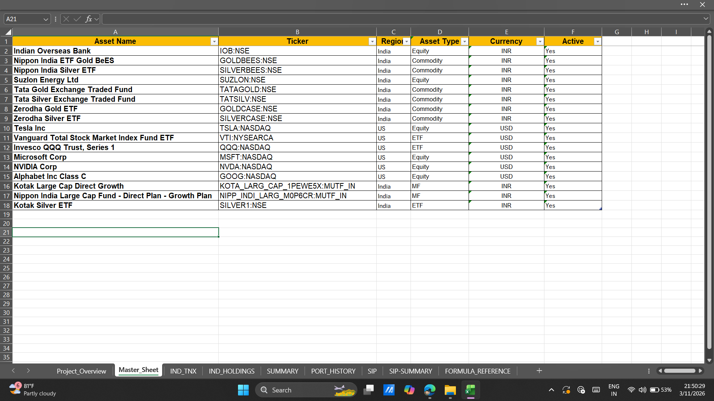

# 📊 Portfolio Visualizer (Excel Dashboard)

Portfolio Visualizer is an Excel-based financial analytics dashboard designed to track stock investments, SIP contributions, and portfolio performance.

## 🌐 Live Project

View the project here:

https://karthickraja46.github.io/Portfolio-Visualizer-Excel-Dashboard/

## 📊 Try the Dashboard

Download the Excel file and explore the portfolio analytics system.

👉 **[Download Portfolio Visualizer](./Portfolio%20Visualizer.xlsx)**

Open the file in Microsoft Excel to interact with the dashboard, portfolio summary, SIP tracker, and holdings analysis.

## 📌 Project Overview

This project provides a structured way to monitor stock holdings, calculate portfolio value, track investment history, and analyze returns using automated Excel formulas and visual dashboards.

## 🚀 Features

• Portfolio dashboard showing total invested capital, current value, and profit
• Stock holdings tracker with automatic return calculation
• SIP investment tracking and summary analysis
• Portfolio history tracking for performance monitoring
• Financial calculations using Excel formulas
• Organized formula reference for transparency

## 📂 Project Structure

Master_Sheet – Central data management
IND_HOLDINGS – Individual stock holdings tracker
PORT_HISTORY – Portfolio performance history
SIP – Systematic investment plan tracker
SIP-SUMMARY – SIP performance summary
SUMMARY – Portfolio dashboard
FORMULA_REFERENCE – Documentation of formulas used

## 🛠 Tools Used

Microsoft Excel
Financial Analysis
Data Visualization
Portfolio Analytics

## 📈 Future Improvements

• Monthly portfolio performance analysis
• Risk metrics such as drawdown analysis
• Sector allocation visualization
• Automated stock price updates
• Portfolio diversification analysis
## 📸 Project Dashboard Preview

### Portfolio Summary Dashboard

### Holdings Tracker

### Portfolio History

### SIP Summary

### Master Data Sheet

## 👨‍💻 Author

Karthick Raja
